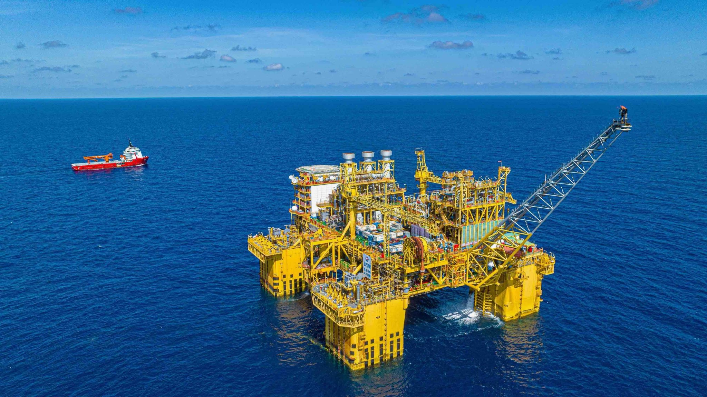
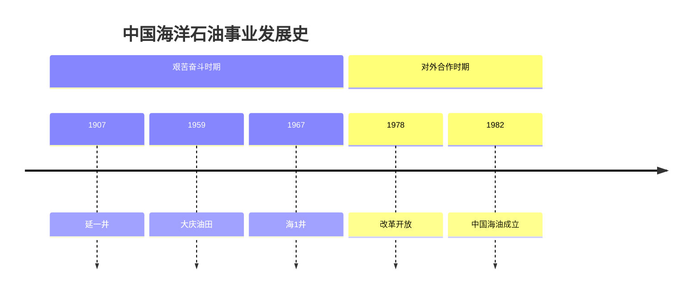
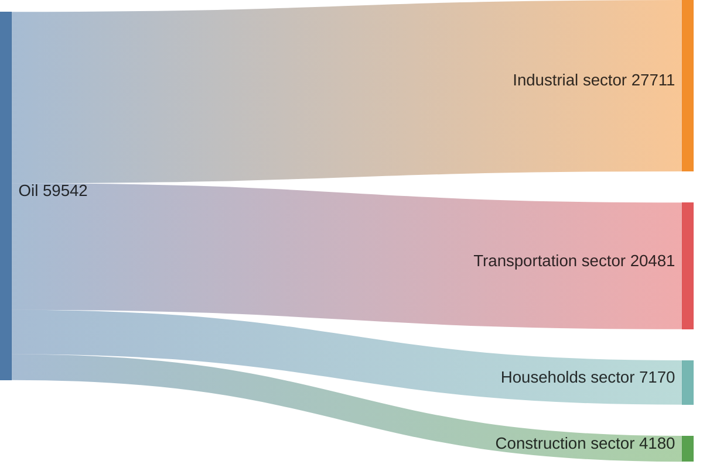

# CNOOC发展史 

深耕蓝色国土，勇立时代潮头。奋力书写能源报国新篇章。




## 艰苦奋斗时期

* 1907年 延一井
    ```

    中国陆上第一口工业化开采的油井，中国大陆不依赖外国技术、独自钻凿成功的第一口油井。
    
    位于陕西省延安市延长县。

    ```
* 1959年 大庆油田
* 1967年6月 海1井
    - 海上第一口油井
* 代表人物
    1. 铁人 王进喜
    2. 海油青年 刘桂芝
        - 日本电焊大赛冠军
        - 全国劳模
* 下海找油-渤海勘探队
    * 用慈溪的小船装上勘探设备
    * 64名海军

## 对外合作时期





## 跨越发展时期




<!--  revene 29400/32 30700/32  4205/32 profit 1646.76亿元、503.13亿元、1379.36亿元 /18 -->
<!-- heads 443,000 373,000 83,000 -->
<!-- Profit per Head 2.02 0.76 9.16  -->
<!-- Total Oil and Gas Equivalent 16.6 5.1 7.1  -->

## 高质量发展时期

  - 杨海风
    - 渤海油田勘探开发工作
    - 找到了亿吨级大油田 垦利-61
  - 深海一号
  - 观澜号
  - 天津智能制造基地


