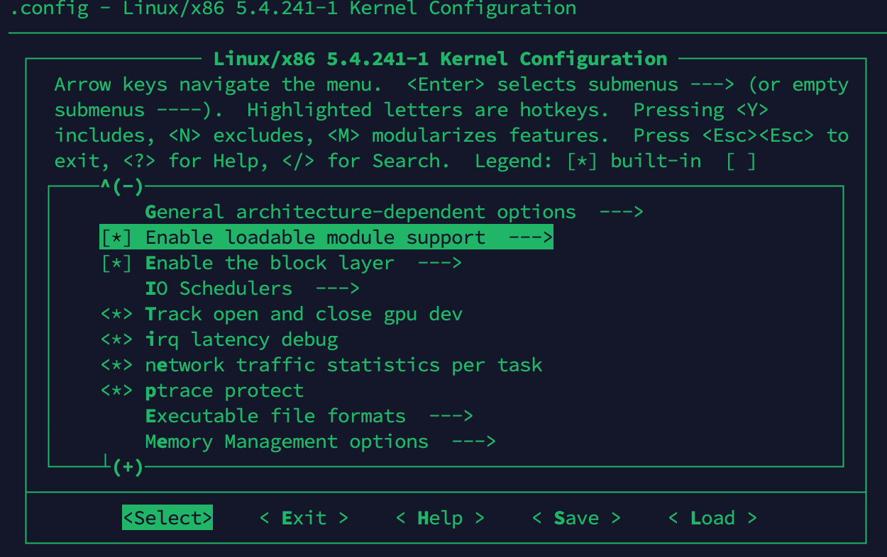
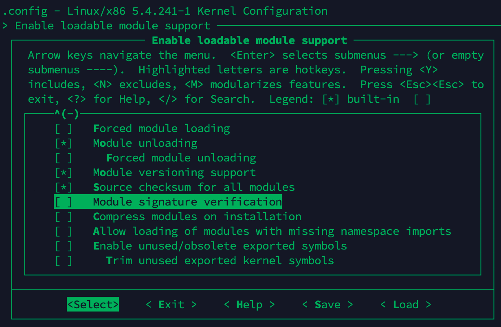
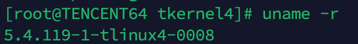
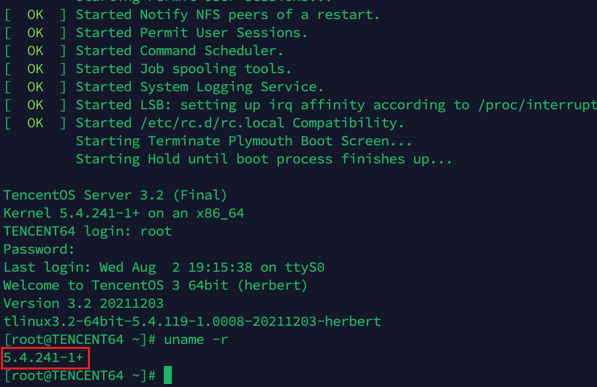
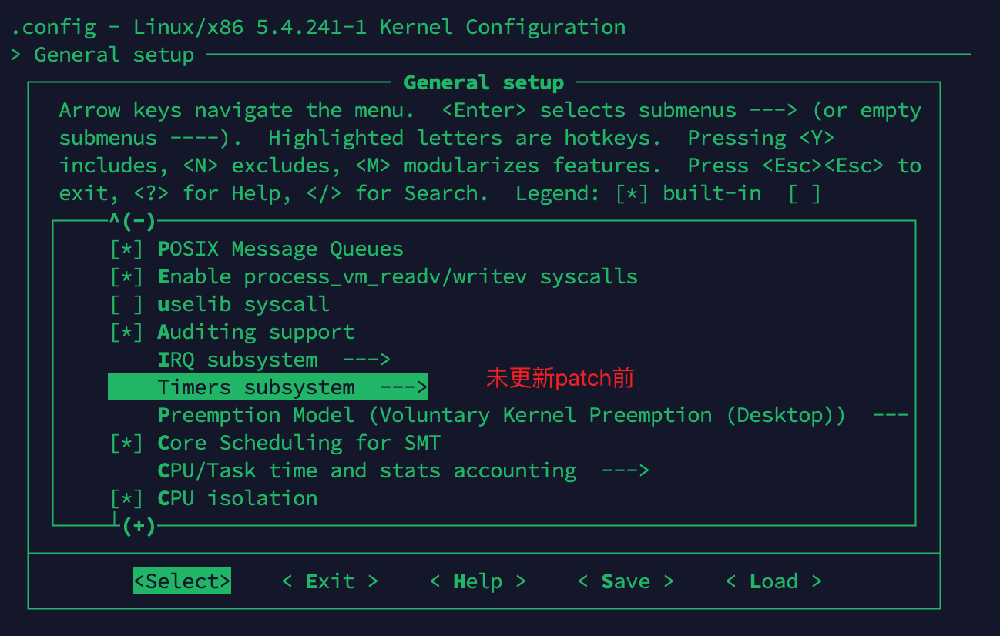
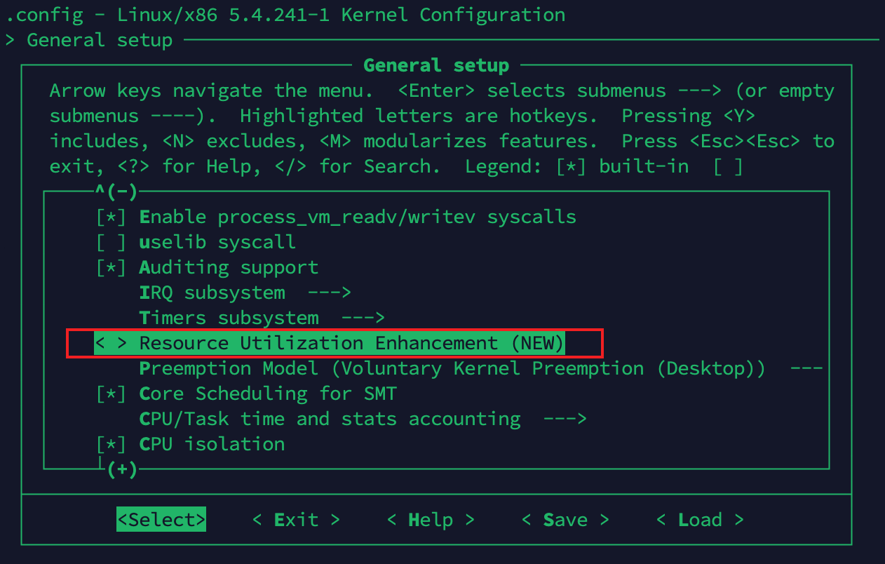
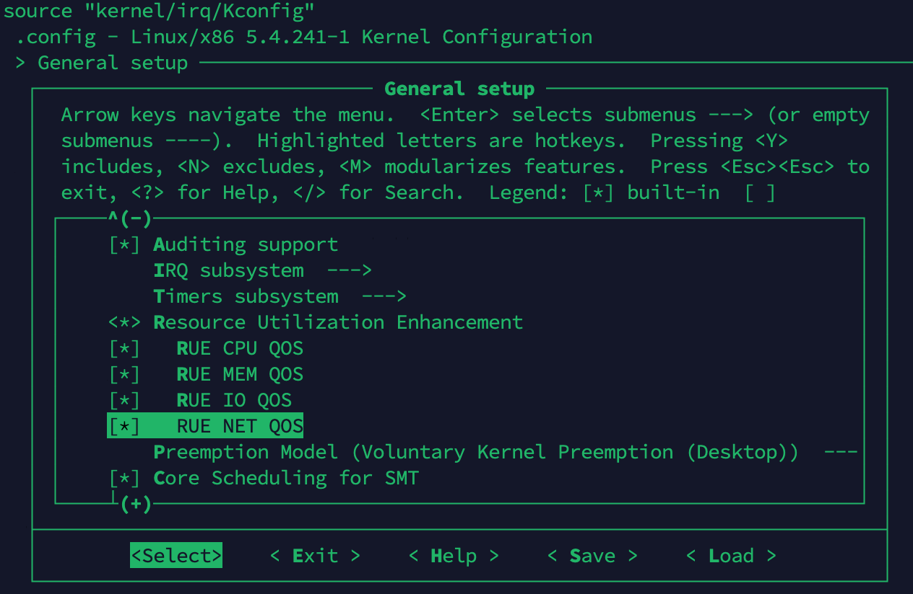

## 熟悉内核编译

了解menuconfig，kconfig等。了解内核代码树结构。

### 观察内核代码结构

  ```shell
    tree -L 1
  ```

### 编译内核

  Git branch: lts/5.4.241-1-tlinux4-0017

  1. `make ARCH=x86 tencentconfig`
  2. `make menuconfig`    将模块签名去掉


    {.half-width}
    {.half-width}

  3. `make -j8`

    > 编译可能会碰到错误，根据提示安装下列包：
    >
    > yum install openssl-devel
    >
    > yum install elfutils-libelf-devel
    >
    > yum install dwarves

  4. `make modules_install`

  5. `make install`
  
    {.half-width}

  6. `reboot`

    


## 编写简单的内核模块

  支持三种模式：<span class="blue">**编译进内核**</span>、<span class="blue">**m**</span>、<span class="blue">**独立编译**</span>


!!! info "编译进内核，m和独立编译"
    <span class="blue">m</span>指在make menuconfig菜单中加载新模块[]中的标识。其中[ ]代表不编译该模块，[*]代表将其加入内核代码树一起编译，[M]为单独编译该模块不加入内核代码树。<span class="blue">m</span>对应最后一个，<span class="blue">编译进内核</span>对应第二个。

    区别 ：编译进内核后用modprobe而不是需要insmod，后两者需要。后两者区别：m在tkernel4文件夹内部，独立编译任意指定文件夹。独立编译和前两者区别：前两者需要配置/kernel/Makefile和 init/Kconfig

    这里只展示<span class="blue">编译进内核</span>和<span class="blue">独立编译</span>，<span class="blue">m</span>大同小异略去

### 编译进内核

  1. 添加模块代码（以添加rue模块为例）

    ```
    kernel/rue/Kconfig
    kernel/rue/Makefile
    kernel/rue/cpu_qos.c
    kernel/rue/io_qos.c
    kernel/rue/mem_qos.c
    kernel/rue/net_qos.c
    kernel/rue/rue_main.c
    ```

  2. 修改 /kernel/Makefile（使make的时候可以编译）

    ```
    @@ -43,6 +43,7 @@ obj-y += irq/
    obj-y += rcu/
    obj-y += livepatch/
    obj-y += dma/
    +obj-y += rue/
    
    obj-$(CONFIG_CHECKPOINT_RESTORE) += kcmp.o
    obj-$(CONFIG_FREEZER) += freezer.o
    ```

  3. 修改 /init/Kconfig（使其加入menuconfig）

    ```
    @@ -373,6 +373,7 @@ config AUDITSYSCALL

    source "kernel/irq/Kconfig"
    source "kernel/time/Kconfig"
    +source "kernel/rue/Kconfig"
    source "kernel/Kconfig.preempt"
    
    menu "CPU/Task time and stats accounting"
    ```
  
  4. Make menuconfig 生成.config文件（如果有模块签名去掉模块签名）
    
    {.half-width}
    {.half-width}
    {.half-width}


??? success "控制台"
    ```shell
    [root@TENCENT64 ~]# modprobe rue              #无报错表明成功
    [root@TENCENT64 ~]# lsmod
    Module                  Size  Used by
    rue                    16384  0
    sunrpc                397312  1
    virtio_balloon         24576  0
    sch_fq_codel           20480  5
    binfmt_misc            24576  1
    ip_tables              28672  0
    virtio_net             57344  0
    net_failover           20480  1 virtio_net
    failover               16384  1 net_failover
    iscsi_tcp              24576  0
    libiscsi_tcp           32768  1 iscsi_tcp
    libiscsi               61440  2 libiscsi_tcp,iscsi_tcp
    fuse                  118784  1
    autofs4                45056  2

    [root@TENCENT64 ~]# dmesg
    [    0.000000] Linux version 5.4.241-1+ (root@TENCENT64.site) (gcc version 8.4.1 20200928 (Red Hat 8.4.1-1) (GCC)) #4 SMP Thu Aug 3 02:38:31 CST 2023
    [    0.000000] Command line: BOOT_IMAGE=(hd0,msdos1)/boot/vmlinuz-5.4.241-1+ root=UUID=5d6283fe-cde6-459f-810c-88c92336a6d5 ro quiet elevator=noop console=ttyS0,115200 console=tty0 vconsole.keymap=us crashkernel=1800M-64G:256M,64G-128G:512M,128G-:768M vconsole.font=latarcyrheb-sun16 i8042.noaux net.ifnames=0 biosdevname=0 intel_idle.max_cstate=1 intel_pstate=disable iommu=pt amd_iommu=on
    [    0.000000] x86/fpu: x87 FPU will use FXSAVE
    ...
    [    6.493898] startagent.sh (770): /proc/842/oom_adj is deprecated, please use /proc/842/oom_score_adj instead.
    [  163.486416] RUE mod init
    [  163.486417] exp for mod load test on 23.8.2.

    [root@TENCENT64 ~]# rmmod rue
    [root@TENCENT64 ~]# lsmod
    Module                  Size  Used by
    sunrpc                397312  1
    virtio_balloon         24576  0
    sch_fq_codel           20480  5
    binfmt_misc            24576  1
    ip_tables              28672  0
    virtio_net             57344  0
    net_failover           20480  1 virtio_net
    failover               16384  1 net_failover
    iscsi_tcp              24576  0
    libiscsi_tcp           32768  1 iscsi_tcp
    libiscsi               61440  2 libiscsi_tcp,iscsi_tcp
    fuse                  118784  1
    autofs4                45056  2
    [root@TENCENT64 ~]# dmesg
    ...
    [    6.493898] startagent.sh (770): /proc/842/oom_adj is deprecated, please use /proc/842/oom_score_adj instead.
    [  163.486416] RUE mod init
    [  163.486417] exp for mod load test on 23.8.2.
    [  261.490733] RUE mod exit
    ```


## 给内核打补丁

  制作自己的测试内核并替换


??? success "控制台"
    ```shell
    [root@TENCENT64 ~]# modprobe rue              #无报错表明成功
    [root@TENCENT64 ~]# lsmod
    Module                  Size  Used by
    rue                    16384  0
    sunrpc                397312  1
    virtio_balloon         24576  0
    sch_fq_codel           20480  5
    binfmt_misc            24576  1
    ip_tables              28672  0
    virtio_net             57344  0
    net_failover           20480  1 virtio_net
    failover               16384  1 net_failover
    iscsi_tcp              24576  0
    libiscsi_tcp           32768  1 iscsi_tcp
    libiscsi               61440  2 libiscsi_tcp,iscsi_tcp
    fuse                  118784  1
    autofs4                45056  2

    [root@TENCENT64 ~]# dmesg
    [    0.000000] Linux version 5.4.241-1+ (root@TENCENT64.site) (gcc version 8.4.1 20200928 (Red Hat 8.4.1-1) (GCC)) #4 SMP Thu Aug 3 02:38:31 CST 2023
    [    0.000000] Command line: BOOT_IMAGE=(hd0,msdos1)/boot/vmlinuz-5.4.241-1+ root=UUID=5d6283fe-cde6-459f-810c-88c92336a6d5 ro quiet elevator=noop console=ttyS0,115200 console=tty0 vconsole.keymap=us crashkernel=1800M-64G:256M,64G-128G:512M,128G-:768M vconsole.font=latarcyrheb-sun16 i8042.noaux net.ifnames=0 biosdevname=0 intel_idle.max_cstate=1 intel_pstate=disable iommu=pt amd_iommu=on
    [    0.000000] x86/fpu: x87 FPU will use FXSAVE
    ...
    [    6.493898] startagent.sh (770): /proc/842/oom_adj is deprecated, please use /proc/842/oom_score_adj instead.
    [  163.486416] RUE mod init
    [  163.486417] exp for mod load test on 23.8.2.

    [root@TENCENT64 ~]# rmmod rue
    [root@TENCENT64 ~]# lsmod
    Module                  Size  Used by
    sunrpc                397312  1
    virtio_balloon         24576  0
    sch_fq_codel           20480  5
    binfmt_misc            24576  1
    ip_tables              28672  0
    virtio_net             57344  0
    net_failover           20480  1 virtio_net
    failover               16384  1 net_failover
    iscsi_tcp              24576  0
    libiscsi_tcp           32768  1 iscsi_tcp
    libiscsi               61440  2 libiscsi_tcp,iscsi_tcp
    fuse                  118784  1
    autofs4                45056  2
    [root@TENCENT64 ~]# dmesg
    ...
    [    6.493898] startagent.sh (770): /proc/842/oom_adj is deprecated, please use /proc/842/oom_score_adj instead.
    [  163.486416] RUE mod init
    [  163.486417] exp for mod load test on 23.8.2.
    [  261.490733] RUE mod exit
    ```

